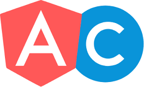

# Angular Connect :: Workspace

Angular Connect 2019 conference code and resources for the Workspace mini-workshop. There is a
deployed version of the reference application at: [https://www.AngularArchitecture.com](https://www.AngularArchitecture.com). For any questions or comments, please contact me direct on twitter [https://twitter.com/angularlicious](@angularlicious).

## Angular Architecture - A CLEAN Architecture Guide for Enterprise Angular Applications

I am nearing the completion of my book on Angular Architecture. There is an entire section dedicated to Angular Workspace.

For a limited time (until Sept. 30, 2019), you may have a **_free_** copy of the book. The final release will be later this year.

[Get the Angular Architecture Book here.](http://leanpub.com/angular-architecture-the-unofficial-guide/c/GEyJqDG8wxw3)

- available until September 30, 2019
- only 20 free copies available with this coupon
